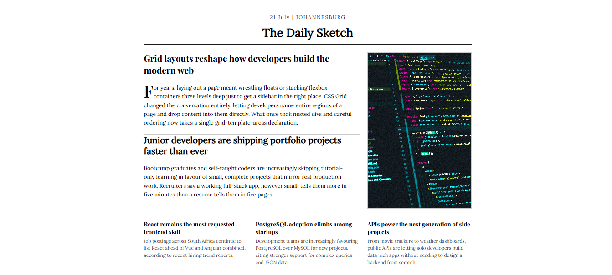

# The Daily Sketch — Newspaper Layout

A responsive newspaper front page built with pure HTML and CSS Grid, as part of freeCodeCamp's Responsive Web Design certification.

**[Live Demo](https://dailysketch21.netlify.app/)**



## Overview

This project recreates a classic newspaper front page — masthead, feature article, secondary article, three smaller stories, and a cover image — entirely through CSS Grid's `grid-template-areas`, without any layout frameworks.

## Features

- Semantic HTML structure (`header`, `article`, `figure`)
- Four-row, three-column grid layout using named grid areas
- Editorial typography with a serif display font for headlines and a serif body font for copy
- Drop cap on the feature article's opening paragraph
- Responsive layout that collapses to a single column on smaller screens

## Built With

- HTML5
- CSS3 (Grid, `::first-letter`, media queries)
- [Google Fonts](https://fonts.google.com/) — Playfair Display & Lora

## Running Locally

Clone the repo and open `index.html` in your browser — no build step required.

```bash
git clone <repo-url>
cd newspaper-layout
open index.html
```

## Acknowledgments

Built as part of the [freeCodeCamp Responsive Web Design](https://www.freecodecamp.org/learn/responsive-web-design/) curriculum.
